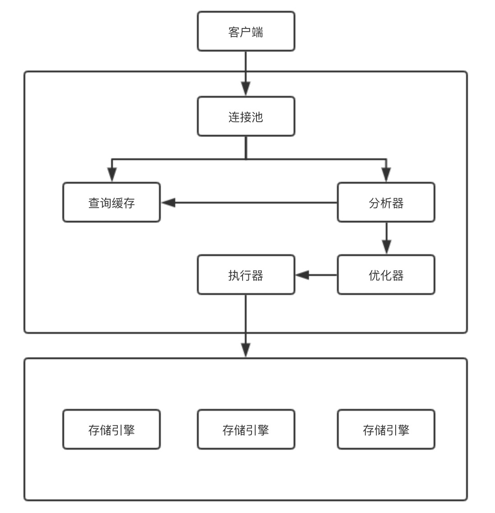

## MySQL基础架构


MySQL的基础架构图如下所示，这是一个查询语句所要经历的模块。当然，这只是针对8.0以前的版本，在8.0以后，该特性被移除，可以从[官方文档](https://dev.mysql.com/doc/refman/8.0/en/mysql-nutshell.html#mysql-nutshell-deprecations)中看到。




#### 连接池（Connection Pool）

主要职责为权限校验和连接管理。

- 当碰到用户密码输入错误时，会抛出```Access denied for user```的错误
- 当连接被断开后，客户端再次发送请求，会收到`Lost connection to MySQL server during query`异常
- 若多次使用查询，应使用长连接，避免连接建立的开销。但是过多的长连接会消耗大量的内存


#### 查询缓存（Query Cache）

建立连接后，程序会判断该查询是否有缓存存在，如果有，则返回缓存结果。当执行器获取到结果后，会将结果存储在查询缓存中。

然而，在生产环境下，缓存的命中率并不高，这是由于当表发生更新行为时，该表的缓存便失效了。因此，在8.0之后，查询缓存将被移除，成为历史了。

#### 分析器（Parser）

主要职责是翻译sql语句和sql对象访问校验

在这里，一个sql语句会被翻译为MySQL内部的命令，分析器会通过查询表维护模块，校验对象的访问校验，如当sql中的某列不存在，则会抛出 ```Unknown column ```的错误

#### 优化器（Optimizer）

主要职责是统计数据及访问路径的生成

在这个阶段，优化器会决定该查询要怎么执行，比如当有多个可使用的索引时，执行结果是一样的，但是执行效率是不同的，优化器会在这个阶段选择效率最高的数据访问路径。

#### 执行器

主要职责是判断数据访问权限和调用存储引擎执行查询

数据访问权限不同于连接池阶段的访问权限，这里为更细粒度的表级别的权限控制。

#### 存储引擎

这个是MySQL高扩展性的体现，可插拔的存储引擎。不同的存储引擎有不同的特点。常见的如MyISAM、InnoDB及Memory。

这里才是真正数据查询、存储的地方，而上述的执行器，也是通过调用存储引擎的接口完成的。